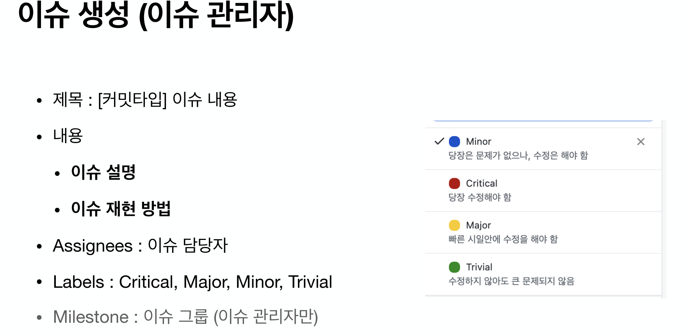

# smart_retail

## [커밋 메시지 작성1법 알아보기](./Docs/git_commit_messge_convention.md)

## [릴리즈 버전 규칙 정의하는 방법](./Docs/software_release_version-rule.md)

## [Git으로 배포하는 방법](https://gist.github.com/yejune/5ac27c2052467a92079f682357864617)

-type-0527.png)
